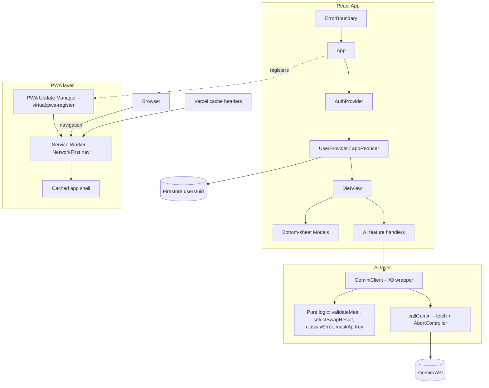

# Design Document

## Overview

This design covers a bundle of improvements for **Smakołysz**, a React 19 + Vite 8 + TypeScript PWA diet planner backed by Firebase/Firestore and the Google Gemini API. The work spans four concerns:

1. **PWA refresh reliability** — make a normal reload reliably load the current HTML plus matching hashed assets, apply new service-worker versions promptly, keep the shell available offline with consistent asset versions, and align deployment cache headers (Requirements 1–4).
2. **AI reliability and correctness** — use a valid Gemini model, bound requests with a timeout, request structured JSON output and parse it in a single step, validate meals strictly, make meal-swap efficient and predictable, keep raw AI responses out of production logs, and handle the API key safely (Requirements 5–10).
3. **Mobile UX** — establish a global mobile CSS baseline, handle safe-area insets for the notch/home indicator, and present mobile-friendly bottom-sheet modals with adequate touch targets (Requirements 11–13).
4. **Resilience** — wrap the app in a React Error Boundary so a thrown render error shows a friendly Polish fallback instead of a blank screen (Requirement 14).

The guiding design principle is **separation of pure logic from side effects**. The current `GeminiClient` interleaves network I/O, parsing, validation, retry loops, and logging in single methods, which makes the logic hard to reason about and impossible to test deterministically. This design extracts the decision logic (error classification, meal validation, swap-candidate selection, key masking) into pure functions that are property-testable, leaving thin I/O wrappers around them.

### Research Notes

- **Gemini model names.** The configured model `gemini-3.1-flash-lite` is not a published model id and causes request failures. Google's documented stable, generally available models include `gemini-2.5-flash` and `gemini-2.5-flash-lite` (see [Gemini API models documentation](https://ai.google.dev/gemini-api/docs/models)). This design standardizes on `gemini-2.5-flash` as a supported, low-latency default. Content was rephrased for compliance with licensing restrictions.
- **Structured output.** The Gemini `generateContent` REST endpoint supports `generationConfig.responseMimeType: "application/json"` plus a `responseSchema` to force schema-conformant JSON, removing the need for fragile text-extraction fallbacks (see [Gemini structured output docs](https://ai.google.dev/gemini-api/docs/structured-output)). Content was rephrased for compliance with licensing restrictions.
- **Request cancellation.** `fetch` accepts an `AbortSignal`; `AbortController` combined with `setTimeout` provides a standard, well-supported request timeout. `AbortSignal.timeout(ms)` is also available in modern browsers but `AbortController` is used here for explicit cleanup control.
- **PWA update strategy.** `vite-plugin-pwa` exposes `virtual:pwa-register` for update lifecycle handling and Workbox `runtimeCaching` for navigation strategies. A `NetworkFirst` strategy on navigation requests with a short network timeout, combined with `navigateFallback`, satisfies "fresh on reload, available offline" (see [vite-plugin-pwa docs](https://vite-pwa-org.netlify.app/)).
- **Safe-area insets.** The `env(safe-area-inset-*)` CSS environment variables require `viewport-fit=cover` in the viewport meta tag to be exposed on notched devices (per the CSS Environment Variables / WebKit viewport-fit specification).

## Architecture



### Layered responsibilities

- **PWA layer (Requirements 1–4):** Configured declaratively in `vite.config.ts` (Workbox) and `vercel.json` (cache headers), plus a small `PWA_Update_Manager` module registered from `main.tsx` via `virtual:pwa-register`.
- **AI layer (Requirements 5–10):** `GeminiClient` becomes a thin orchestrator. Decision logic is extracted into pure, exported functions in a new `src/ai/geminiLogic.ts` module. Transport (`callGemini`) owns `fetch`, the abort timeout, retry-on-transient-status, and structured-output request construction.
- **UI/UX layer (Requirements 11–14):** Global CSS in `index.css`, viewport meta in `index.html`, a reusable `Modal`/`BottomSheet` wrapper component used by existing modals, and a new `ErrorBoundary` component wrapping the root tree in `main.tsx`.

### Key design decisions

- **Extract pure logic from `GeminiClient`.** Rationale: the swap selection, validation, and error-classification rules are the parts with the highest bug risk and the strongest universal properties. Isolating them as pure functions makes them deterministically testable and removes hidden retry waste.
- **Single source of truth for the swap loop.** The current code runs up to 4 attempts, and each attempt internally retries up to 3 times on transient errors (12 potential network calls). The new design distinguishes *swap attempts* (max 4, one Gemini call each) from *transient-status retry* (handled inside a single `callGemini` with capped backoff), and selection is a pure function over the produced candidates.
- **Strict validation replaces lenient normalization.** The current `validateMeal` accepts `calories`/`instructions` aliases and does not reject negative or non-finite numbers. Because structured output now enforces the schema, validation becomes strict per Requirement 7.3/7.4.
- **Reuse existing storage path for the API key.** The key already lives in `AppState.geminiApiKey`, persisted to `users/{uid}` in Firestore. Requirement 10 is satisfied by hardening the Settings UI (masking, reveal, empty-save rejection) and by never echoing the key into errors.

## Components and Interfaces

### PWA components

**`vite.config.ts` (Workbox runtime caching).** Replace the autoUpdate-only config with an explicit navigation strategy:

```ts
VitePWA({
  registerType: 'prompt', // managed by PWA_Update_Manager
  workbox: {
    navigateFallback: '/index.html',
    navigateFallbackDenylist: [/^\/assets\//, /^\/sw\.js$/, /^\/workbox-/],
    cleanupOutdatedCaches: true,
    runtimeCaching: [
      {
        urlPattern: ({ request }) => request.mode === 'navigate',
        handler: 'NetworkFirst',
        options: {
          cacheName: 'html-cache',
          networkTimeoutSeconds: 3,
          plugins: [/* expiration */],
        },
      },
    ],
  },
})
```

**`src/pwa/registerPwa.ts` (PWA_Update_Manager).** New module:

```ts
export interface PwaUpdateManager {
  // Begins SW registration; auto-applies updates when no offline edits are pending.
  register(opts: { hasPendingEdits: () => boolean }): void;
}
```

Behavior: uses `registerSW` from `virtual:pwa-register`. On `onNeedRefresh`, if `hasPendingEdits()` is false it calls `updateSW(true)` to activate and reload within one cycle; otherwise it defers and re-checks after edits flush. On activation failure it logs a diagnostic and leaves the current version active (Requirement 2.4).

**`vercel.json` (cache headers).** Already largely correct; this design treats it as the validated artifact for Requirement 4 (`no-cache, no-store, must-revalidate` on `/index.html`, `no-cache` on `/sw.js`, `public, max-age=31536000, immutable` on `/assets/*`). A header-validation test asserts these values.

### AI components

**`src/ai/geminiLogic.ts` (new — pure functions).**

```ts
export const SUPPORTED_MODELS: readonly string[];      // documented Gemini model ids
export const DEFAULT_MODEL = 'gemini-2.5-flash';

export type GeminiErrorKind =
  | 'invalid_model' | 'invalid_key' | 'missing_key'
  | 'timeout' | 'transient' | 'processing' | 'unknown';

// Maps an HTTP status + body (or thrown error) to a fatal/retryable classification.
export function classifyGeminiError(status: number | undefined, body: string): GeminiErrorKind;

// Polish, key-free message for an error kind.
export function errorMessage(kind: GeminiErrorKind): string;

// Strict Meal validation per Requirement 7.3/7.4 (no aliases, finite >= 0, etc.).
export function validateMeal(obj: unknown): obj is Omit<Meal, 'id' | 'eaten'>;

// Pure selection over produced candidates for a swap (Requirement 8).
export interface SwapSelection { kind: 'success'; meal: Meal } | { kind: 'failure' };
export function selectSwapResult(candidates: Meal[], originalKcal: number): SwapSelection;

// Returns true when a candidate is within ±5% of originalKcal.
export function isWithinKcalBand(kcal: number, originalKcal: number): boolean;

// Replaces every character of the key with a uniform mask character.
export function maskApiKey(key: string): string;

// Removes any occurrence of the key from a message (defense in depth).
export function stripKey(message: string, key: string): string;

// True when raw AI response logging is permitted (DEV === true only).
export function isRawLoggingAllowed(): boolean;
```

**`src/ai/geminiClient.ts` (refactored — I/O orchestration).** Public method signatures are unchanged so existing callers (`DietView`, `SwapMealModal`, `FridgeModal`, etc.) keep working. Internals change:

```ts
export class GeminiClient {
  constructor(apiKey: string, opts?: { model?: string; timeoutMs?: number });

  swapMeal(currentMeal, userProfile, userComment?, sameDayTitles?): Promise<GeminiResponse>;
  generateFullDay(userProfile, otherDays?, existingMeals?): Promise<GeminiResponse>;
  generateFromFridge(ingredients, mealType, userProfile): Promise<GeminiResponse>;
  estimateMealFromDescription(description, mealType): Promise<GeminiResponse>;

  // Transport: builds structured-output request, applies AbortController timeout,
  // retries only on transient status (503/429) with capped backoff.
  private callGemini(prompt, schema): Promise<unknown /* parsed JSON */>;
}
```

- `timeoutMs` is clamped to the inclusive range [1000, 30000], defaulting to 30000 (Requirement 6.1).
- `swapMeal` loops at most 4 times (Requirement 8.2): each iteration calls `callGemini` once, validates, and stops early on the first in-band candidate; after the loop it delegates to `selectSwapResult` for the closest-candidate fallback.
- `callGemini` requests `responseMimeType: 'application/json'` with the meal `responseSchema`, then does a single `JSON.parse` on the returned text (Requirement 7.1/7.2).
- All raw-response logging is gated behind `isRawLoggingAllowed()` (Requirement 9).

**Request shape (structured output):**

```ts
{
  contents: [{ parts: [{ text: prompt }] }],
  generationConfig: {
    temperature: 0.8,
    maxOutputTokens: 4096,
    responseMimeType: 'application/json',
    responseSchema: MEAL_SCHEMA, // or { type: 'array', items: MEAL_SCHEMA }
  },
}
```

### UI/UX components

**`src/components/Modal.tsx` (new — responsive wrapper).** A shared presentational wrapper used by `AddMealModal`, `EditMealModal`, `SwapMealModal`, `FridgeModal`, etc.:

```ts
interface ModalProps {
  isOpen: boolean;
  onClose: () => void;
  title: string;
  children: React.ReactNode;
}
```

Behavior: below 640px it renders as a `Bottom_Sheet` (full width, anchored bottom, slide-up/slide-down animation 150–400ms, max-height = viewport with scrollable body); at ≥640px it renders as a centered dialog. Interactive controls get a minimum 44×44px touch target via a utility class.

**`src/components/ErrorBoundary.tsx` (new).**

```ts
class ErrorBoundary extends React.Component<
  { children: React.ReactNode },
  { hasError: boolean; error?: Error; info?: React.ErrorInfo }
> {
  static getDerivedStateFromError(error: Error): Partial<State>;
  componentDidCatch(error: Error, info: React.ErrorInfo): void;
  // Fallback: Polish heading + message + single reload button.
  // In DEV shows error.message + componentStack; in prod hides them.
}
```

Wraps the root tree in `main.tsx`: `<ErrorBoundary><App /></ErrorBoundary>`.

**`src/index.css` and `index.html`.** Global baseline: transparent tap highlight, `overscroll-behavior: none` on the root scroll container, safe-area inset padding utilities; `index.html` viewport becomes `width=device-width, initial-scale=1.0, viewport-fit=cover`. The `Header` adds `padding-top: env(safe-area-inset-top)` and the FAB adds `env(safe-area-inset-bottom)` offsets; `main` adds bottom padding ≥ inset.

## Data Models

The core `Meal` model (from `src/types.ts`) is unchanged:

```ts
type MealType = 'Śniadanie' | 'II Śniadanie' | 'Obiad' | 'Przekąska' | 'Kolacja';

interface Meal {
  id: string;
  type: MealType;
  title: string;
  kcal: number;       // finite, >= 0
  protein: number;    // finite, >= 0
  carbs: number;      // finite, >= 0
  fats: number;       // finite, >= 0
  ingredients: string[]; // non-empty
  instruction: string;   // non-empty
  tip?: string;          // when present, a string
  eaten: boolean;
}
```

**Gemini `responseSchema` (new).** Mirrors the validated `Meal` shape (excluding client-only `id`/`eaten`):

```ts
const MEAL_SCHEMA = {
  type: 'object',
  properties: {
    type: { type: 'string', enum: ['Śniadanie', 'II Śniadanie', 'Obiad', 'Przekąska', 'Kolacja'] },
    title: { type: 'string' },
    kcal: { type: 'number' }, protein: { type: 'number' },
    carbs: { type: 'number' }, fats: { type: 'number' },
    ingredients: { type: 'array', items: { type: 'string' } },
    instruction: { type: 'string' },
    tip: { type: 'string' },
  },
  required: ['type', 'title', 'kcal', 'protein', 'carbs', 'fats', 'ingredients', 'instruction'],
};
```

**`GeminiResponse`** (unchanged): `{ success: boolean; data?: Meal | Meal[]; error?: string }`. The `error` string is always a Polish, key-free message.

**API key** lives in `AppState.geminiApiKey`, persisted to Firestore `users/{uid}` (existing `firestoreStorage.ts`). No schema change; the masking and reveal state is local UI state in `ProfileDrawer`.

**Configuration constants:** `DEFAULT_MODEL = 'gemini-2.5-flash'`, `KCAL_BAND = 0.05`, `MAX_SWAP_ATTEMPTS = 4`, `DEFAULT_TIMEOUT_MS = 30000`, `MIN_TIMEOUT_MS = 1000`, `MASK_CHAR = '•'`.

## Correctness Properties

*A property is a characteristic or behavior that should hold true across all valid executions of a system — essentially, a formal statement about what the system should do. Properties serve as the bridge between human-readable specifications and machine-verifiable correctness guarantees.*

The properties below apply to the **AI logic core** (`src/ai/geminiLogic.ts`) and the **state-update invariants**, which are pure and have universal behavior over large input spaces (meals, candidate sequences, error responses, key strings, timeout values). The PWA layer (Requirements 1–4), global CSS / safe-area / modal layout (Requirements 11–13), and the Error Boundary (Requirement 14) are validated with config/snapshot, example, and integration tests instead (see Testing Strategy), because they describe declarative configuration, rendering, or runtime service-worker behavior rather than universally quantified pure logic.

### Property 1: Strict Meal validation

*For any* value, `validateMeal` returns true if and only if `type` is one of the five recognized `MealType` values, `title` and `instruction` are non-empty strings, `kcal`/`protein`/`carbs`/`fats` are finite numbers greater than or equal to 0, `ingredients` is a non-empty array of strings, and (when present) `tip` is a string.

**Validates: Requirements 7.3, 7.4**

### Property 2: Structured Meal JSON round-trip

*For any* valid Meal, serializing it to JSON and parsing the result in a single `JSON.parse` step yields an object that passes `validateMeal` and is field-equal to the original (excluding client-only `id`/`eaten`).

**Validates: Requirements 7.1, 7.2**

### Property 3: Unparseable or invalid responses produce a failure

*For any* response payload that is not valid JSON or whose parsed value fails `validateMeal`, the Gemini_Client returns a result whose success indicator is false with a Polish processing-failure message, and produces no Meal data.

**Validates: Requirements 7.5**

### Property 4: Swap selection picks the best candidate

*For any* sequence of valid candidate Meals and an original `kcal` value: if at least one candidate is within the ±5% Kcal_Tolerance_Band, `selectSwapResult` returns the earliest such in-band candidate; otherwise it returns the candidate whose absolute `kcal` difference from the original is smallest, breaking ties by earliest position; and if the sequence contains no valid candidate it returns a failure.

**Validates: Requirements 8.1, 8.3, 8.4, 8.5**

### Property 5: Swap issues between 1 and 4 requests and stops early

*For any* sequence of mocked Gemini responses, a single Meal_Swap issues no fewer than 1 and no more than 4 requests to the Gemini_API, and stops issuing further requests as soon as a candidate within the Kcal_Tolerance_Band is produced.

**Validates: Requirements 8.2, 8.1**

### Property 6: Fatal Gemini errors stop retrying with a Polish message

*For any* Gemini_API rejection caused by an invalid/unsupported model or an invalid/unauthorized API key, `classifyGeminiError` returns the corresponding fatal kind, the Gemini_Client returns success false with no meal data, issues no further (retry) requests, and the returned message is in Polish and identifies the cause.

**Validates: Requirements 5.2, 5.3**

### Property 7: Missing API key short-circuits without a request

*For any* API key string that is empty or contains only whitespace, every Gemini_Client operation returns success false with a Polish "API key required" message and issues no request to the Gemini_API.

**Validates: Requirements 5.4**

### Property 8: AI failures leave the meal plan unchanged

*For any* application state and any Gemini_Client operation that returns success false, applying the App's result handling produces no mutation to `dayPlans` (the state's meal plan data is identical to the pre-operation state).

**Validates: Requirements 5.5**

### Property 9: Timeout value is clamped to the valid range

*For any* configured timeout input (including out-of-range numbers, non-finite values, or undefined), the effective timeout used by the Gemini_Client is between 1000 and 30000 milliseconds inclusive, and an unconfigured timeout resolves to 30000 milliseconds.

**Validates: Requirements 6.1**

### Property 10: Production builds never log raw AI responses

*For any* AI_Response content, when `import.meta.env.DEV` is false or undefined, no console method (`log`, `warn`, `error`, `info`, `debug`) is invoked with that content or any substring of it.

**Validates: Requirements 9.1, 9.3**

### Property 11: API key is excluded from returned error messages

*For any* API key string and any Gemini_Client error condition, the `error` message in the returned `GeminiResponse` does not contain the API key value as a substring.

**Validates: Requirements 10.4**

### Property 12: API key masking hides every original character

*For any* API key string, `maskApiKey` returns a string of the same length composed solely of the uniform mask character, such that none of the original characters of the key is visible.

**Validates: Requirements 10.3**

### Property 13: Empty key save is rejected and retains the previous key

*For any* input string that is empty or contains only whitespace, the Settings save operation is rejected, the previously stored API key value is left unchanged, and an error indicating that an API key is required is surfaced.

**Validates: Requirements 10.5**

## Error Handling

**AI errors (Requirements 5, 6, 7, 8).** All Gemini failures funnel through `GeminiResponse { success: false, error }` with a Polish, key-free message produced by `errorMessage(kind)`:

- `missing_key` → "Brak klucza API Gemini." (no request issued)
- `invalid_model` → message identifying an invalid model configuration (no retry)
- `invalid_key` → message identifying an invalid API key (no retry)
- `timeout` → Polish timeout message (request aborted, partial data discarded)
- `transient` (503/429) → retried inside `callGemini` with capped backoff; surfaced only if all transient retries are exhausted
- `processing` → Polish processing-failure message for parse/validation failures

Callers (`DietView.handleGenerateDay`, `SwapMealModal.handleSwap`, etc.) already show the `error` via `showToast(..., 'error')` and never dispatch a mutating action on failure, satisfying Requirement 5.5. The in-progress loading flag (`aiGenerating`, `loading`) is cleared in a `finally`-equivalent path after resolve or abort (Requirement 6.4).

**PWA errors (Requirement 2.4, 3.4).** If service-worker activation fails, the `PWA_Update_Manager` logs an operational diagnostic and leaves the current version active; pending user data is untouched because activation never blocks Firestore/local persistence. If no complete shell is cached offline, the SW returns the offline fallback document.

**Storage errors (Requirement 10.6).** `writeUserState` already catches Firestore write failures. The Settings save flow surfaces a Polish error and retains the previously stored key when a write rejects.

**Render errors (Requirement 14).** The `ErrorBoundary` catches any descendant render/lifecycle throw and renders a Polish fallback (heading + message + single reload control). In DEV it shows `error.message` and the component stack; in production it hides both.

## Testing Strategy

The project already uses **Vitest** with **@testing-library/react** and **fast-check** (`package.json` dev-deps) and jsdom. This design uses a dual approach: property-based tests for the AI logic core and state invariants, and example/integration/config tests for everything else.

### Property-based tests (fast-check, ≥100 runs)

Implemented against `src/ai/geminiLogic.ts` and the reducer. Each test is tagged with a comment referencing its design property, e.g. `// Feature: app-improvements, Property 4: Swap selection picks the best candidate`. fast-check's default run count is ≥100; configure explicitly where needed.

- Prop 1 (validation): generate valid meals (accepted) and structurally-mutated objects (rejected); assert `validateMeal` matches the spec predicate, including `tip` non-string rejection.
- Prop 2 (round-trip): generate valid meals; assert `validateMeal(JSON.parse(JSON.stringify(meal)))` and field equality.
- Prop 3 (parse failure): generate non-JSON strings and schema-violating objects; assert failure result.
- Prop 4 (swap selection): generate candidate arrays + original kcal; assert in-band-first / closest / earliest-tie / empty-failure selection.
- Prop 5 (request bound): drive `swapMeal` with a mocked `callGemini` returning generated candidate sequences; assert call count ∈ [1,4] and early stop on first in-band hit.
- Prop 6 (fatal errors): generate model-not-found and unauthorized response bodies/statuses; assert fatal classification, Polish message, single call (no retry).
- Prop 7 (missing key): generate empty/whitespace keys; assert failure + `fetch` never called.
- Prop 8 (state unchanged): generate arbitrary `AppState` and a failing result; assert `dayPlans` unchanged (no mutating dispatch).
- Prop 9 (timeout clamp): generate numbers, NaN, Infinity, undefined; assert clamped timeout ∈ [1000,30000] and undefined→30000.
- Prop 10 (no prod logging): spy all console methods; generate response strings with DEV false/undefined; assert none called with the content.
- Prop 11 (key excluded): generate keys + error conditions; assert returned `error` excludes the key.
- Prop 12 (key masking): generate keys; assert `maskApiKey` output is same length, only mask chars, none of the originals.
- Prop 13 (empty save): generate whitespace/empty inputs; assert save rejected and prior key preserved.

### Example / unit tests

- AI request shape (7.1): assert request body includes `responseMimeType` and a `responseSchema` with the required fields.
- Timeout behavior (6.2, 6.3): mocked hanging `fetch` + fake timers; assert timeout `GeminiResponse` and no partial data.
- Logging allowances (9.2, 9.4): DEV=true raw log permitted; prod operational diagnostics permitted.
- API key UI (10.2, 10.6, 10.7): fetch spy confirms key only sent to Gemini URL; write-rejection retains key; reveal toggle shows plaintext.
- PWA update manager (2.2, 2.3, 2.4): mock `registerSW`; assert auto-apply when no pending edits, deferral when pending, current-version retention on activation failure.
- Header-validator (4.4, 4.5): unit test the predicate rejecting permissive `index.html`/`sw.js` headers and non-immutable/short-max-age asset headers.
- Modals & layout (12.x, 13.x): render `Modal` below/at 640px and assert bottom-sheet vs centered, 16px input font, 44×44 touch targets, animation durations 150–400ms, overflow scroll, and safe-area padding (inset 0 fallback).
- Error Boundary (14.x): render a throwing child; assert Polish fallback heading/message and single reload control; DEV shows stack, prod hides it; clicking reload invokes reload.

### Config / snapshot / smoke tests

- Cache headers (4.1–4.3): assert exact `vercel.json` header values.
- Model id (5.1): assert `DEFAULT_MODEL ∈ SUPPORTED_MODELS`.
- Viewport meta (12.1): assert `index.html` viewport includes `viewport-fit=cover`.
- Global CSS (11.1, 11.3, 11.5): assert presence of transparent tap-highlight, `overscroll-behavior`, and `env(safe-area-inset-*)` rules.
- Workbox config (1.3): snapshot `runtimeCaching` NetworkFirst nav with `networkTimeoutSeconds: 3` and `navigateFallback`.

### Integration / manual tests

- Service-worker freshness, offline shell consistency, and update activation (1.x, 2.1, 3.x): exercised with a built bundle and a simulated redeploy / offline mode, plus manual verification of the no-hard-refresh reload and visual tap/scroll behavior (11.2, 11.4).
