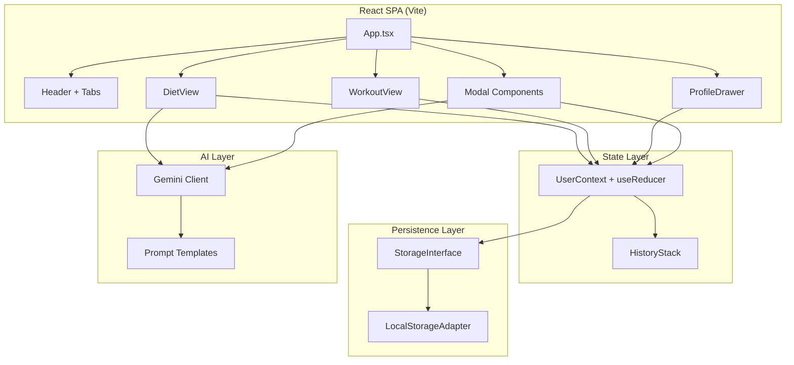
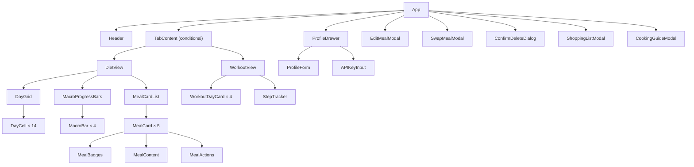
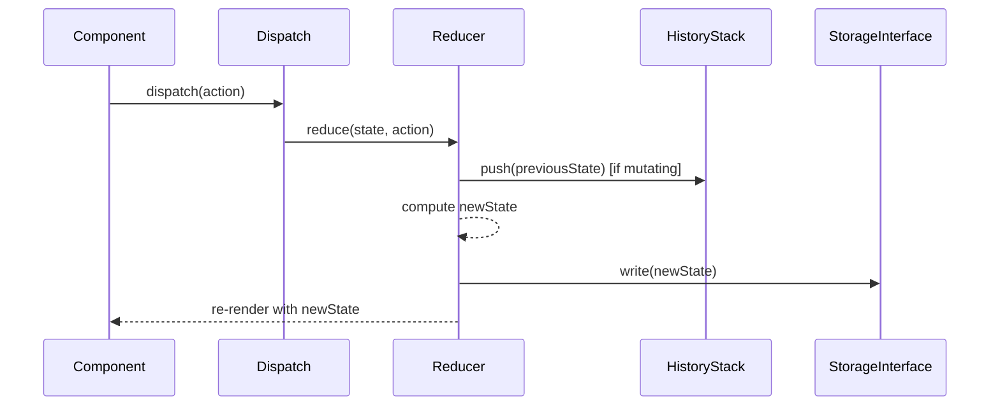

# Design Document: Silhouette Planner

## Overview

The Silhouette Planner is a React + TypeScript SPA built with Vite, providing an interactive 14-day diet/workout planning tool with AI-powered meal generation. The architecture follows a unidirectional data flow pattern with React Context + useReducer for state management, localStorage for persistence (abstracted behind an interface for future Firebase migration), and a thin Gemini API integration layer for AI features.

The application is structured as a tabbed interface with DietView and WorkoutView as primary content areas, a collapsible ProfileDrawer, and modal overlays for meal editing and AI interactions. All UI text is in Polish.

## Architecture

### High-Level Architecture



### Technology Stack

| Layer | Technology | Purpose |
|-------|-----------|---------|
| Build | Vite 5+ | Dev server, HMR, production builds |
| UI Framework | React 18+ | Component-based UI |
| Language | TypeScript (strict) | Type safety, no `any` |
| Styling | Tailwind CSS 3 | Utility-first styling with design tokens |
| Animation | Framer Motion (motion/react) | Transitions, micro-interactions |
| Icons | Lucide React | Consistent icon set |
| AI | Google Gemini 2.0 Flash Lite | Meal generation/swap |
| Persistence | localStorage (abstracted) | Client-side state persistence |
| Deployment | Vercel | Static SPA hosting |

### Design Tokens (Tailwind Config)

```typescript
// tailwind.config.ts extensions
{
  colors: {
    // Primary accent (interactive)
    primary: colors.emerald,
    // Nutrition/energy indicators
    nutrition: colors.amber,
    // Text and surfaces
    surface: {
      bg: colors.slate[50],
      bgAlt: colors.slate[100],
      card: '#ffffff',
      text: colors.slate[800],
      textStrong: colors.slate[900],
    }
  },
  borderRadius: {
    card: '1.5rem', // rounded-3xl
  },
  fontFamily: {
    sans: ['Geist', 'Inter', 'system-ui', 'sans-serif'],
  }
}
```

## Components and Interfaces

### Component Hierarchy



### Component Contracts

#### `App.tsx`
- Wraps everything in `<UserProvider>`
- Manages active tab state (`'dieta' | 'trening'`)
- Manages ProfileDrawer open/close state
- Manages modal visibility states

#### `Header`
- Props: `activeTab`, `onTabChange`, `onProfileOpen`, `canUndo`, `onUndo`
- Renders app title, tab switcher, undo button, profile button

#### `DietView`
- Reads from UserContext: `dayPlans`, `selectedDay`, `userProfile`
- Dispatches: `SELECT_DAY`, `TOGGLE_EATEN`, `DELETE_MEAL`, `PASTE_DAY`, `COPY_DAY`
- Sub-components: DayGrid, MacroProgressBars, MealCardList

#### `DayGrid`
- Props: `days: DayPlan[]`, `selectedDay: number`, `onSelectDay: (day: number) => void`
- Renders 14 day cells in 2 rows of 7

#### `MacroProgressBars`
- Props: `meals: Meal[]`, `targets: MacroTargets`
- Computes totals from meals, renders 4 bars

#### `MealCard`
- Props: `meal: Meal`, `onToggleEaten`, `onEdit`, `onSwap`, `onDelete`
- Renders full meal details with action buttons

#### `WorkoutView`
- Reads from UserContext: `workoutPlan`, `stepCounts`
- Dispatches: `UPDATE_STEPS`

#### `ProfileDrawer`
- Props: `isOpen: boolean`, `onClose: () => void`
- Reads/writes UserContext profile and API key

#### Modal Components
- `EditMealModal`: Form-based meal editor
- `SwapMealModal`: AI swap interface with comment textarea
- `ConfirmDeleteDialog`: Deletion confirmation
- `ShoppingListModal`: Day selector + ingredient list
- `CookingGuideModal`: Day selector + sequential recipe guide

## Data Models

### Core Types (`src/types.ts`)

```typescript
// Meal types
export type MealType = 'Śniadanie' | 'II Śniadanie' | 'Obiad' | 'Przekąska' | 'Kolacja';

export interface Meal {
  id: string;
  type: MealType;
  title: string;
  kcal: number;
  protein: number;
  carbs: number;
  fats: number;
  ingredients: string[];
  instruction: string;
  tip?: string;
  eaten: boolean;
}

export interface DayPlan {
  day: number; // 1–14
  meals: Meal[];
}

export interface MacroTargets {
  kcal: number;
  protein: number;
  carbs: number;
  fats: number;
}

export interface UserProfile {
  weight: number; // kg
  height: number; // cm
  goal: string;
  dailyCalorieTarget: number;
  dailyProteinTarget: number;
  mealsPerDay: number;
  equipment: string[];
  dislikedIngredients: string[];
  preferredIngredients: string[];
  vegetableRule: string;
}

export interface WorkoutDay {
  id: string;
  name: string; // "Góra A", "Dół A", etc.
  exercises: Exercise[];
}

export interface Exercise {
  name: string;
  sets: number;
  reps: string; // e.g., "8-12" or "max"
  equipment: string;
}

export interface StepCount {
  day: number;
  count: number;
  target: number;
}

// State
export interface AppState {
  userProfile: UserProfile;
  dayPlans: DayPlan[];
  workoutPlan: WorkoutDay[];
  stepCounts: StepCount[];
  selectedDay: number;
  clipboard: DayPlan | null;
  historyStack: AppState[];
  historyIndex: number;
  geminiApiKey: string;
  schemaVersion: number;
}

// Storage abstraction
export interface StorageInterface {
  read(): AppState | null;
  write(state: AppState): void;
  clear(): void;
}

// Actions for useReducer
export type AppAction =
  | { type: 'SELECT_DAY'; day: number }
  | { type: 'TOGGLE_EATEN'; day: number; mealId: string }
  | { type: 'UPDATE_MEAL'; day: number; mealId: string; meal: Meal }
  | { type: 'DELETE_MEAL'; day: number; mealId: string }
  | { type: 'REPLACE_MEAL'; day: number; mealId: string; newMeal: Meal }
  | { type: 'SET_DAY_MEALS'; day: number; meals: Meal[] }
  | { type: 'COPY_DAY'; day: number }
  | { type: 'PASTE_DAY'; targetDay: number }
  | { type: 'UPDATE_STEPS'; day: number; count: number }
  | { type: 'SET_API_KEY'; key: string }
  | { type: 'UNDO' }
  | { type: 'RESTORE_STATE'; state: AppState };
```

### State Management Pattern



**UserContext Implementation:**
- Uses `useReducer` with the `AppAction` union type
- The reducer handles history-push logic for destructive actions (edit, delete, swap, paste, generate)
- After every state transition, the new state is persisted via `StorageInterface.write()`
- On initialization, attempts `StorageInterface.read()` → fallback to seed data
- HistoryStack is stored as an array of partial state snapshots (only `dayPlans` to avoid unbounded memory growth)
- Maximum 10 undo levels; oldest entries are dropped when limit is exceeded

## AI Integration Layer

### Gemini Client (`src/ai/geminiClient.ts`)

```typescript
interface GeminiClientConfig {
  apiKey: string;
  model: string; // 'gemini-2.0-flash-lite'
  maxRetries: number;
}

interface GeminiResponse {
  success: boolean;
  data?: Meal | Meal[];
  error?: string;
}

class GeminiClient {
  constructor(config: GeminiClientConfig);
  
  async swapMeal(
    currentMeal: Meal,
    userProfile: UserProfile,
    userComment?: string
  ): Promise<GeminiResponse>;
  
  async generateFullDay(
    userProfile: UserProfile,
    existingDays?: DayPlan[]
  ): Promise<GeminiResponse>;
  
  private buildSwapPrompt(meal: Meal, profile: UserProfile, comment?: string): string;
  private buildFullDayPrompt(profile: UserProfile, existingDays?: DayPlan[]): string;
  private parseJsonResponse(text: string): Meal | Meal[] | null;
}
```

### Prompt Templates

**Swap Meal Prompt Structure:**
1. System context: "You are a Polish nutrition assistant..."
2. Current meal JSON
3. User constraints (dislikes, equipment, preferences, vegetable rule)
4. Target macros (±10% of original)
5. User comment (optional)
6. Output format: strict JSON matching Meal interface

**Full-Day Generation Prompt Structure:**
1. System context: "You are a Polish nutrition assistant..."
2. User profile + constraints
3. Daily targets: 2200 kcal ±5%, 150g protein ±5g
4. Meal types required: Śniadanie, II Śniadanie, Obiad, Przekąska, Kolacja
5. Variety instruction: avoid repeating ingredients from existingDays
6. Output format: JSON array of 5 Meal objects

### JSON Parsing Strategy

The Gemini response is parsed with the following approach:
1. Attempt `JSON.parse()` on the full response text
2. If that fails, search for JSON block delimiters (```json ... ```) and extract
3. If that fails, search for the first `[` or `{` and attempt to parse from there
4. Validate the parsed result against the Meal interface structure (required fields check)
5. If validation fails, return error response

## Error Handling

| Scenario | Handling |
|----------|----------|
| Gemini API key missing | Disable AI buttons, show warning banner in Polish |
| Gemini returns invalid JSON | Show toast error in Polish, keep original data |
| Gemini API rate limit / network error | Show toast error, suggest retry, keep original data |
| localStorage quota exceeded | Show console warning, continue with in-memory state |
| Malformed localStorage data | Reset to seed data, log console warning |
| Schema version mismatch | Reset to seed data, log console warning |

All error messages are displayed in Polish using toast notifications (Framer Motion animated).


## Correctness Properties

*A property is a characteristic or behavior that should hold true across all valid executions of a system—essentially, a formal statement about what the system should do. Properties serve as the bridge between human-readable specifications and machine-verifiable correctness guarantees.*

### Property 1: State Persistence Round-Trip

*For any* valid AppState object, serializing it via `StorageInterface.write()` and then deserializing via `StorageInterface.read()` SHALL produce an object deeply equal to the original (excluding transient fields like historyStack).

**Validates: Requirements 4.7, 16.1, 16.2**

### Property 2: Macro Summation Correctness

*For any* list of Meal objects with arbitrary non-negative kcal, protein, carbs, and fats values, the computed daily totals SHALL equal the arithmetic sum of each respective field across all meals in the list.

**Validates: Requirements 6.2**

### Property 3: Eaten Macro Filtering

*For any* list of Meal objects with arbitrary eaten states (true/false), the computed "eaten total" for each macro SHALL equal the sum of that macro's value only for meals where `eaten === true`.

**Validates: Requirements 6.4, 8.2**

### Property 4: Toggle Eaten is its Own Inverse

*For any* Meal in any DayPlan, toggling `eaten` twice (dispatch TOGGLE_EATEN → dispatch TOGGLE_EATEN) SHALL produce a state where the meal's `eaten` field is identical to its original value.

**Validates: Requirements 8.3**

### Property 5: History Push on Mutation

*For any* AppState and any single mutating action (UPDATE_MEAL, DELETE_MEAL, REPLACE_MEAL, SET_DAY_MEALS, PASTE_DAY), dispatching that action SHALL increase the historyStack length by exactly 1, and the top of the stack SHALL contain the previous state's dayPlans.

**Validates: Requirements 9.5, 10.5, 11.5, 12.8, 13.5, 15.5**

### Property 6: History Stack Bounded

*For any* sequence of N mutating actions where N > 10, the historyStack length SHALL never exceed 10 entries.

**Validates: Requirements 15.1**

### Property 7: Undo Restores Previous State

*For any* AppState S and any single mutating action, performing the action and then dispatching UNDO SHALL produce a state where `dayPlans` is deeply equal to S's `dayPlans`.

**Validates: Requirements 15.3**

### Property 8: Copy/Paste Preserves Day Plan

*For any* DayPlan source and any target day number, dispatching COPY_DAY(source.day) then PASTE_DAY(targetDay) SHALL result in the target day's meals being deeply equal to the source day's meals (with new IDs).

**Validates: Requirements 11.4**

### Property 9: AI Prompt Constraint Inclusion

*For any* valid UserProfile and any Meal (for swap prompts), the generated prompt string SHALL contain: every item from `dislikedIngredients`, every item from `equipment`, and the calorie/protein targets.

**Validates: Requirements 12.4, 12.5, 13.1, 13.2**

### Property 10: Shopping List Completeness

*For any* non-empty subset of DayPlans, the generated shopping list SHALL contain every unique ingredient string that appears in any meal of the selected days.

**Validates: Requirements 18.2**

### Property 11: Shopping List Deduplication and Sort

*For any* list of ingredient strings (including duplicates), the shopping list generator SHALL produce an output that: (a) contains no duplicate entries, (b) is sorted in alphabetical order, and (c) applying the generator again on the output produces the same output (idempotent).

**Validates: Requirements 18.3**

### Property 12: Cooking Guide Ordering

*For any* ordered subset of DayPlans, the generated cooking guide SHALL list instructions in day-ascending order, and within each day, in meal-type order (Śniadanie → II Śniadanie → Obiad → Przekąska → Kolacja).

**Validates: Requirements 19.1, 19.2**

## Testing Strategy

### Approach

The testing strategy uses a dual approach:

1. **Property-Based Tests** (fast-check): Verify universal correctness properties across randomly generated inputs. Minimum 100 iterations per property test.
2. **Unit/Example Tests** (Vitest + React Testing Library): Verify specific UI behaviors, rendering, and integration points.

### Property-Based Testing (fast-check)

**Library**: [fast-check](https://github.com/dubzzz/fast-check) — the standard PBT library for TypeScript/JavaScript.

**Configuration**:
- Minimum 100 iterations per property
- Each test tagged with: `Feature: silhouette-planner, Property N: [title]`

**Properties to implement**:
| # | Property | Target Module |
|---|----------|---------------|
| 1 | State Persistence Round-Trip | `src/context/UserContext.tsx` + storage adapter |
| 2 | Macro Summation Correctness | `src/utils/macros.ts` |
| 3 | Eaten Macro Filtering | `src/utils/macros.ts` |
| 4 | Toggle Eaten Inverse | `src/context/UserContext.tsx` reducer |
| 5 | History Push on Mutation | `src/context/UserContext.tsx` reducer |
| 6 | History Stack Bounded | `src/context/UserContext.tsx` reducer |
| 7 | Undo Restores Previous State | `src/context/UserContext.tsx` reducer |
| 8 | Copy/Paste Preserves | `src/context/UserContext.tsx` reducer |
| 9 | AI Prompt Constraint Inclusion | `src/ai/geminiClient.ts` |
| 10 | Shopping List Completeness | `src/utils/shoppingList.ts` |
| 11 | Shopping List Dedup + Sort | `src/utils/shoppingList.ts` |
| 12 | Cooking Guide Ordering | `src/utils/cookingGuide.ts` |

### Unit/Example Tests (Vitest + React Testing Library)

**Coverage areas**:
- Component rendering (MealCard, DayGrid, MacroBar, WorkoutView)
- Modal open/close flows
- Tab navigation
- ProfileDrawer interaction
- API key storage
- Error states (invalid JSON from Gemini, missing API key)
- Edge cases (malformed localStorage, empty day plans)

### Test File Structure

```
src/
├── __tests__/
│   ├── properties/
│   │   ├── statePersistence.property.test.ts
│   │   ├── macros.property.test.ts
│   │   ├── history.property.test.ts
│   │   ├── copyPaste.property.test.ts
│   │   ├── aiPrompts.property.test.ts
│   │   ├── shoppingList.property.test.ts
│   │   └── cookingGuide.property.test.ts
│   ├── components/
│   │   ├── MealCard.test.tsx
│   │   ├── DayGrid.test.tsx
│   │   ├── MacroBar.test.tsx
│   │   └── WorkoutView.test.tsx
│   └── context/
│       └── UserContext.test.tsx
```
